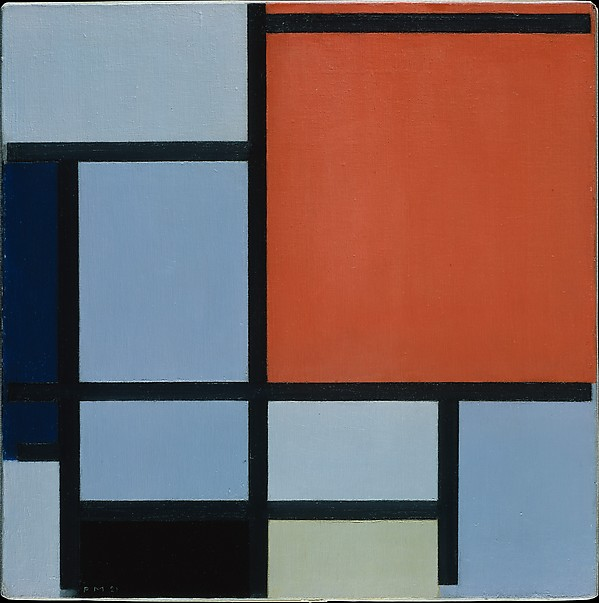

# evoimage

Simple attempt at evolving image reproductions

## Overview

todo

## Fitness Function

todo

## Representation

todo

## Mutation

todo

## Crossover

todo

## Implementation

todo

## Images

* "Portrait of Isabel Parreño y Arce, Marquesa de Llano, Anton Raphael Mengs, 1771 - 1772"
  by Anton Raphael Mengs is licensed under CC0 1.0
  https://ccsearch.creativecommons.org/image/detail/TJmttlM53HMeELT3IduwGw==
* "Landscape" by Carle (Antoine Charles Horace) Vernet (French, Bordeaux 1758–1836 Paris)
  via The Metropolitan Museum of Art is licensed under CC0 1.0 
  https://ccsearch.creativecommons.org/image/detail/7J6dR75Zr50Kwq7_Ax0ehw==
* "Composition" by Piet Mondrian (Dutch, Amersfoort 1872–1944 New York) via
  The Metropolitan Museum of Art is licensed under CC0 1.0 
  https://ccsearch.creativecommons.org/image/detail/wGM3NBEVzE0rIfI48n1NIQ==
* "mondrian" by apenny is licensed under CC BY 2.0 
  https://ccsearch.creativecommons.org/image/detail/dci6KvaAj9FaCqASttXsEQ==
* "Versailles" by Auguste Renoir (French, Limoges 1841–1919 Cagnes-sur-Mer) via
  The Metropolitan Museum of Art is licensed under CC0 1.0
  https://ccsearch.creativecommons.org/image/detail/LZKw8dOJS85mFqXEMeWrwA==
* "The Milliner" by Auguste Renoir (French, Limoges 1841–1919 Cagnes-sur-Mer) via
  The Metropolitan Museum of Art is licensed under CC0 1.0 
  https://ccsearch.creativecommons.org/image/detail/6DhumcJp7g8tXzWCgIfjog==

Our initial attempt will be a Mondrian:

